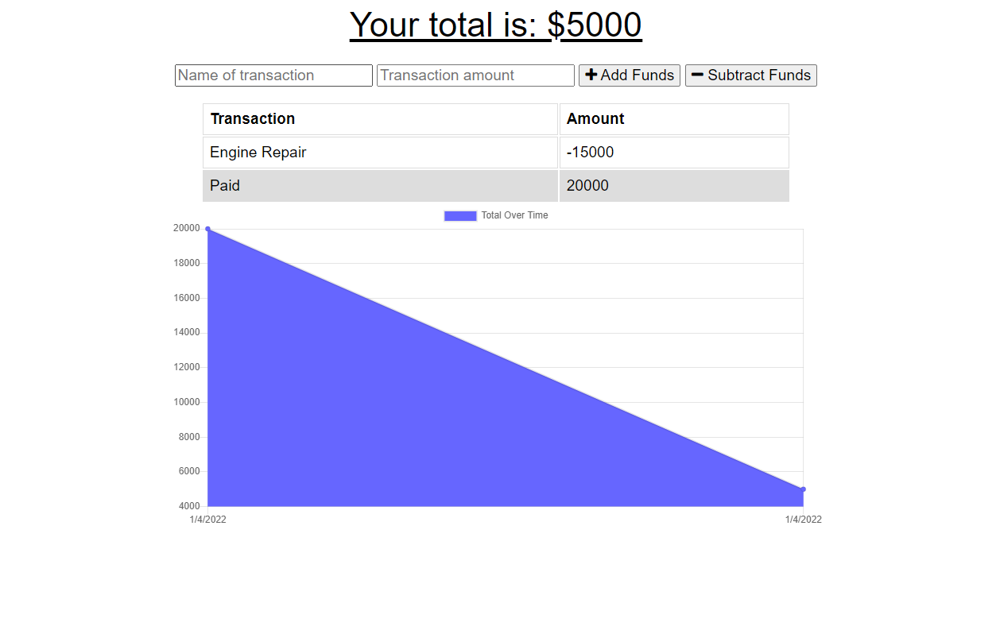

# Budget Tracker 

## Description

This budget tracker utilizes MongoDb and Expree to create an online/offline PWA with a list of transactions.

[Heroku/MongoDB Deploy](https://budget-tracker-depl.herokuapp.com/)

## Contents

-   [Installation](#installation)
-   [Usage](#usage)
-   [Contributors](#contributors)
-   [License](#license)
-   [Contact](#contact)

## Installation

Clone the github, then run "npm i" in the root folder.

## Usage

To use the project locally, run "npm start" and go to "localhost:3000"

## License

The project uses the [Creative Commons](https://creativecommons.org/licenses/) license.

## Contact

Link to my github: [sagegrayson](https://github.com/sagegrayson)

If you'd like to contact me, email me at [skaseyg@gmail.com](mailto:skaseyg@gmail.com)
